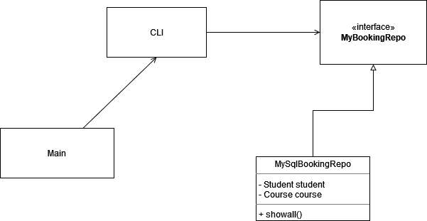

# JDBC UND DAO – BUCHUNGEN

Die Buchung wäre in der "Datenbanksprache" eine *intersection* *entity*. Das heißt, sie ist eine Entität, die zwei oder mehrere Entitäten mit einander verbindet. Besser Ausgedrückt, sie hält die Beziehung anderer Entitäten fest. Im *ERD*-Modell würde man demnach, zwei oder mehrere Fremdschlüssel in dieser Entität vorfinden. 

Im Fall vom Kurssystem, hält die Buchungsentität die Beziehung zwischen Kursen und Studenten fest. Die Buchungsentität löst eine N zu N Beziehung auf (Ein Student kann mehrere Kurse besuchen und ein Kurs kann mehrere Studenten haben). 

Die Buchung würde zwar eine eindeutige ID (AUTO INKREMENT) besitzen, dennoch würde ich nicht vom `BaseRepository` erben wollen, da ich für diese DAO-Klasse vielleicht eigene generische Typen kreieren würde. Auf alle Fälle würde das DAO beide, Studenten und Kurse, als Instanzvariablen halten. Eine besseres Design ist mir nicht eingefallen. 

Die beliebtesten Abfragen einer Buchung (Methoden): 

* Die letzten 10 Buchungen anzeigen
* Zu welcher Zeit wurde gebucht
* Welcher Kurs wurde am öftesten gebucht
* Der Student mit den meisten Buchungen

Die Domänenklasse würde meiner Meinung nach nicht sehr spannend aussehen. Zwei Fremdschlüssel in Form von Student und Kurs würde die Klasse Buchung halten. An der *CLI* könnte man über einen weiteren Manager verfügen (Buchungsmanager). 
