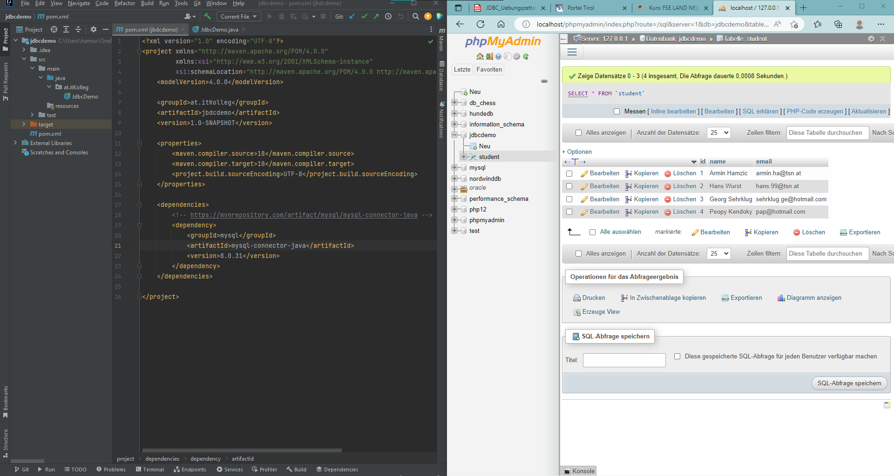

# Datenpersistenz

In der Programmierung bezeichnet Persistenz die Lebensdauer einer Variable. Die Datenpersistenz ist die dauerhafte Aufbewahrung von Daten in einem Datenbank-Managementsystem (DBMS). Die Lebensdauer von Daten muss von den Benutzern direkt oder indirekt bestimmbar sein und darf nicht von irgendwelchen Systemgegebenheiten abhängen. Weiters sind Änderungen, die eine Transaktion in einer Datenbank vornimmt, dauerhaft.

## JDBC-Übungszettel

Im weiteren Verlauf verlinke ich alle fertiggestellten Aufgaben. Über die Verlinkungen kommt man in den richtigen Ordner und dort befinden sich README Dateien. In diesen README Dateien befinden sich Dokumentationen mit eigenen Erklärungen und die dazugehörigen Versuchsprotokolle zum verfassten Quellcode.

Alle aufgelisteten Aufgaben sind hier zu finden: [Der Übungszettel](JDBC_Uebungszettel_V3-3.pdf)

[Aufgabe 1: JDBC Intro Teil 1](jdbcdemo)

[Aufgabe 2: JDBC Intro Teil 2](jdbcdemo2)

[Aufgabe 3: JDBC und DAO - Kurse](kurssystem)

[Aufgabe 4: JDBC und DAO - Studenten]()

[Aufgabe 5: JDBC und DAO - Buchungen]()

## JDBC

Java Database Connectivity erlaubt es über Java auf Datenbanken zuzugreifen.

Die Entwicklungsumgebung beinhaltet einen Webserver und einen Datenbankserver mit Admin-Konsole. Dies ist mit XAMPP oder Docker möglich. Schritte zum einrichten der Umgebung mittels XAMPP:

1. Download von XAMPP

2. Apache Webserver und die Mysql-Datenbank starten

3. Neues Maven Projekt anlegen

4. MySql-Connector-Java Dependency in die pom.xml Datei hinzufügen, diese findet man unter [Maven Repository: mysql-connector-java](https://mvnrepository.com/artifact/mysql/mysql-connector-java)

5. Eine Datenbank inklusive Tabelle und Spalten über phpmyadmin (localhost/phpmyadmin) erstellen
     * 5.1 Gegebenenfalls erstellt man noch eine Main Klasse mit einer Main-Methode
     * 5.2 Man kann weiters Metadaten in die gerade erstellte Tabelle einfügen (name, email), um Versuchsdaten zu erstellen

## DAO-Entwurfsmuster

Data Access Object (Datenzugriffsobjekt) ist ein Entwurfsmuster, um genauer zu sein ein Muster für die Gestaltung von Programmierschnittstellen (APIs). Über DAO können in der Folge unterschiedliche Datenquellen (Datenbanken, Dateisystem) angesprochen werden. Durch Kapselung kann die angesprochene Datenquelle ausgetauscht werden, ohne dabei den aufrufenden Code zu ändern. DAO ist eng verwandt mit dem Entwurfsmuster Transferobjekt (Spielen zusammen mit DAO, weil diese Objekte die Datensätze halten).

Eigenschaften:

* DAOs sind nicht zuständig für die Transformation der Daten in die Struktur der Datenbank -> abstrahieren den Zugriff auf Datenbanken nicht vollständig
* DAOs sind jeweils für ein spezielles Speichermedium optimiert -> Zugriff auf das Medium wird über die zu implementierende API vorgenommen
* DAOs minimieren den Portierungsaufwand einer Anwendung beim Wechsel des Speichermediums

## Singleton-Entwurfsmuster

Das Singleton-Pattern soll absichern, dass von einer Klasse maximal ein Exemplar existiert. Dazu wird durch die Klasse, die als Singleton implementiert ist, ein globaler Zugriffspunkt auf die einzige Instanz bereitgestellt. Man kann nur über diesen Zugriffspunkt an eine Instanz der Singleton-Klasse gelangen. 

Im Zusammenhang mit DAO ist das Singleton-Muster praktisch, da man nur einmal im Programm eine Datenbankverbindung aufrufen muss. Diese Verbindung ist dann im Singleton gespeichert und ist zur Laufzeit nicht mehr änderbar.

## CRUD

Das Akronym **CRUD** umfasst die vier grundlegenden Operationen persistenter Speicher

* **C**reate, Datensatz anlegen
* **R**ead, Datensatz lesen
* **U**pdate, Datensatz aktualisieren
* **D**elete oder **D**estroy, Datensatz löschen

