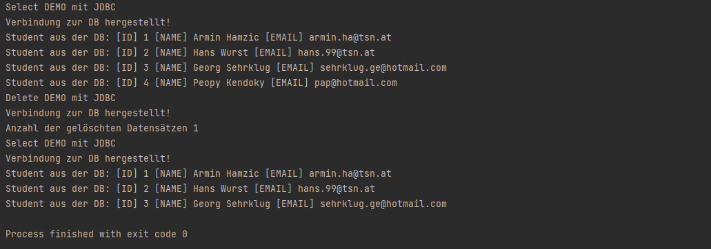
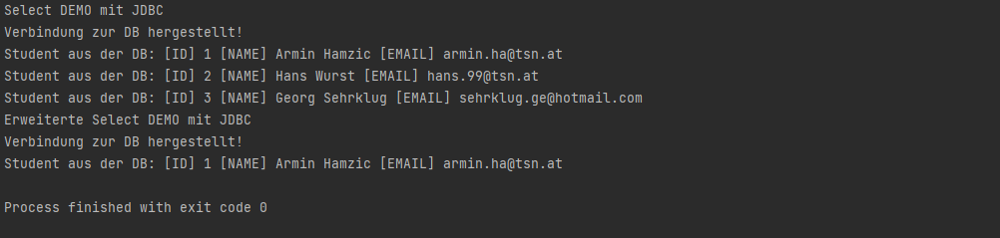

# JDBC Intro Teil 1 - Demo-Projekt

!Achtung, der verfasste Quellcode im Demo-Projekt soll die Verständlichkeit der Anwendung von JDBC verbessern und ist deshalb mit Code-Duplikaten ausgestattet!

Aufgrund der durchgeführten Einrichtung einer Entwicklungsumgebung (siehe: erstes README bei Überschrift JDBC) ist es nun möglich über das Java Programm, mittels SQL-Statements, mit einer Datenbank zu kommunizieren. Dabei ist es wichtig eine Verbindung mit der entsprechenden Datenbank aufzubauen (Url, user, pwd). 

```java
public static void selectAllDemo(){
        String sqlSelectAllPersons = "SELECT * FROM `student`"; //select-statement
        String connectionUrl = "jdbc:mysql://localhost:3306/jdbcdemo"; //Verbindungs-Url
    
        // Verbindung zur DB aufbauen
        try(Connection conn = DriverManager.getConnection(connectionUrl,"root","")){
            System.out.println("Verbindung zur DB hergestellt!");
            //... *Code im try-Block
        }catch(SQLException e){
            System.out.println("Fehler beim Aufbau einer Verbindung.. " +e.getMessage());
        }
    }
```

Der Vorteil die Connection wie im Code dargestellt, in runden Klammern im Kopf des try-Blocks zu schreiben ist das Verzichten einer `close()` Methode, weil es sich automatisch schließt wenn der try-Block beendet wird.

---

Der erste Versuch ist ein `SELECT` Statement (Abfrage von Daten). Man sollte wissen welche Datensätze man braucht und wo diese zu finden sind. Um weiter mit bestimmten Datensätzen zu arbeiten sollte man diese in Variablen speichern.

```java
//... *Code im try-Block
PreparedStatement preparedStatement = conn.preparedStatement("SELECT * FROM `student`"); //SQL-Statement
ResultSet rs = preparedStatement.executeQuery(); //rs = Ergebnismenge; executeQuery()-> Ausführung der Abfrage

while (rs.next()){ //wenn es einen nächsten Datensatz gibt befinden wir uns in der Schleife
                int id = rs.getInt("id");
                String name = rs.getString("name");
                String email = rs.getString("email");
                System.out.println("Student aus der DB: [ID] " + id + " [NAME] " + name + " [EMAIL] " + email);
            }
```

PreparedStatement: 

* Speichert das SQL-Statement in einer Variable
* Sendet anschließend dieses Statement an die Datenbank mit der Methode `executeQuery()`

ResultSet: 

* Von der Abfrage ausgehend kommt ein ResultSet zurück
* Das ResultSet hält nun alle Datensätze

---

Der zweite Versuch ist ein `INSERT` Statement (Einfügen von Daten). Man sollte wissen, um welche Datensätze es sich handelt, damit man richtige Datentypen übergeben kann. Das anbinden an die Datenbank bleibt natürlich der gleiche Vorgang. 

```java
public static void insertStudentDemo(){
    //... *Code im try-Block
    
	PreparedStatement preparedStatement = conn.prepareStatement(
    	"INSERT INTO `student` (`id`, `name`, `email`) VALUES (NULL, ?, ?)");
	try{
    	preparedStatement.setString(1,"Pap Azt");
    	preparedStatement.setString(2,"pap@hotmail.com");
    	int rowAffected = preparedStatement.executeUpdate(); //wie viele Datensätze wurden verändert
    	System.out.println(rowAffected + "Datensätze eingefügt");
	}catch(SQLException ex){
		System.out.println("Fehler im SQL-INSERT Statement" + ex.getMessage());
	}
    
    //...mehr Code
```

Die Fragezeichen im PreparedStatement dienen als eine Art Parameter und sind gleichzeitig eine Schutzmaßnahme gegen SQL-Injections. Könnte man direkt die Daten an dieser Stelle eintragen, kann ein Bösewicht auf die Idee kommen ein anderes SQL-Statement einzutragen um Daten in der Datenbank zu verändern. Die Variable `rowAffected` hält die Anzahl der eingefügten Datensätze mittels der Methode `executeUpdate()`. Der verschachtelte try-catch-Block dient zur Fehlerüberprüfung (Wo ist der Fehler aufgetreten?). 

---

Der dritte Versuch ist ein `UPDATE` Statement (Veränderung von Daten). Hierbei ändert sich nicht viel im Vergleich zum `INSERT` Statement, nur der SQL-Befehl ist ein anderer.

```java
public static void updateStudentDemo(){
    //... *Code im try-Block
    
	PreparedStatement preparedStatement = conn.prepareStatement(
    	"UPDATE `student` SET `name` = ? WHERE `student`.`id` = 4");
	try{
		preparedStatement.setString(1,"Peopy Kendoky");
        
    	//...mehr Code
	}
```

Es könnten noch weitere Daten verändert werden, wie zum Beispiel die E-Mail, dann fügt man ein weiteres Fragezeichen hinzu und ruft auch für dieses die `setString()` Methode auf. Um das SQL-Statement der Datenbank zu übergeben wird erneut die Methode `executeUpdate()` aufgerufen. 

---

Der vierte Versuch ist ein `DELETE` Statement (Löschung von Daten). In diesem Fall mit Übergabe eines Parameters, dieser wird anschließend anstatt des Fragezeichens über das PreparedStatement weiterverarbeitet. Erneut ergibt sich eine ähnliche Struktur des Codes wie zu den Vorgängern.

```java
public static void deleteStudentDemo(int studentID){
	//... *Code im try-Block
    
    PreparedStatement preparedStatement = conn.prepareStatement(
        "DELETE FROM `student` WHERE `student`.`id` = ?");
    try{
        preparedStatement.setInt(1,studentID);
        
        //...mehr Code
```

Anstatt eines Strings wird nun ein Integer für die Identifizierung des Studenten gesetzt -> `setInt()`. Um das fertige SQL-Statement der Datenbank zu übergeben wird erneut die Methode `executeUpdate()` aufgerufen.

---

Der fünfte Versuch ist ein modifiziertes `SELECT` Statement (Abfrage/Suche von Daten). Ähnlich wie beim ersten Versuch, doch diesmal mit Parameter und einem abgeänderten SQL-Statement. Zur Wiederholung: Das PreparedStatement hält unser SQL-Statement und das ResultSet hält unsere Datensätze, falls welche zurückgegeben werden.

```java
private static void findAllByNameLike(String pattern) {
    // ... *Code im try-Block
    
        PreparedStatement preparedStatement = conn.prepareStatement(
            "SELECT * FROM `student` WHERE `student`.`name` LIKE ?"); //SQL-Statement
        preparedStatement.setString(1,"%"+pattern+"%"); 
        ResultSet rs = preparedStatement.executeQuery(); //rs = Ergebnismenge; executeQuery()-> Ausführung der Abfrage

        while (rs.next()){ //wenn es einen nächsten Datensatz gibt befinden wir uns in der Schleife
            
           //...mehr Code
```

---

---

**Versuchsprotokoll-1: `SELECT` und `INSERT`**

```java
   public static void main(String[] args) {
        selectAllDemo();
        insertStudentDemo();
        selectAllDemo();
    }
```


---

**Versuchsprotokoll-2: `UPDATE`**

```java
public static void main(String[] args) {
        selectAllDemo();
        updateStudentDemo();
        selectAllDemo();
    }
```


---

**Versuchsprotokoll-3: `DELETE`**

```java
public static void main(String[] args) {
        selectAllDemo();
        deleteStudentDemo();
        selectAllDemo();
    }
```



---

**Versuchsprotokoll-4: `SELECT` (Erweitert)**

```java
public static void main(String[] args) {
        selectAllDemo();
        findAllByNameLike("min");
    }
```

