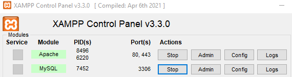
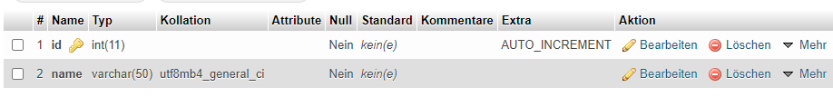

# JDBC Intro Teil 2 - Demo-Projekt

Diese Aufgabe dient zur Wiederholdung. Es wird eine neue Tabelle (die Entität ist nach Wahl) in der MySQL-Datenbank erstellt, diese beinhaltet einen Primärschlüssel mit 2 Spalten. Dabei soll man den Datenbankzugriff aus Java heraus implementieren. 

Arbeitsschritte:

1. Entwicklungsumgebung erschaffen -> Die Datenbank ist erneut über XAMPP zu erreichen. Durch das einschalten des Webservers von Apache und des Startens der MySQL-Datenbank ist es möglich sich über den localhost an der Datenbank anzumelden. 
1. pom.xml konfigurieren -> Es wird ein neues Maven Projekt in der IDE nach Wahl erstellt. Dort öffnet man die neu erstellte pom.xml Datei und fügt die MySql-Connector-Java Dependency ein. 
1. Tabelle erstellen -> Man erstellt eine neue Tabelle und fügt die gewünschten Spalten ein.
1. Verbindung über Quellcode (JDBC) -> Im letzten Schritt wird die Verbindung zur Datenbank mittels Java-Code ausgeführt. Dafür braucht man die richtige URL, den richtigen Usernamen und das richtige Passwort (der anzusprechenden DB). Über die Connection Klasse und der DriverManager Klasse ist es nun möglich sich mit der gewünschten Datenbank zu verbinden. 

**Entwicklungsumgebung starten:**



**Pom.xml konfigurieren:**

```xml
<dependency>
    <groupId>mysql</groupId>
    <artifactId>mysql-connector-java</artifactId>
    <version>8.0.31</version>
</dependency>
```

**Tabelle mit 2 Spalten erstellen:**



**Verbindung über Java:** 

```java
String user = "root";
String pwd = "";
String connUrl = "jdbc:mysql://localhost:3306/jdbcdemo"; // Verbindungs-URL
```

Erklärung des Verbindungspfades: 

* jdbc:mysql: 
* //localhost:3306: ist der Port über den die Datenbank zur Verfügung steht
* /jdbcdemo: ist die erstellte Datenbank-Instanz. 

**Ergebnis mit `INSERT`-Statement:**

```java
try(Connection conn = DriverManager.getConnection(connUrl,user,pwd)) {
    System.out.println("Verbindung zur DB hergestellt!");
    PreparedStatement preparedStatement = conn.prepareStatement("INSERT INTO `kurs` (`id`, `name`) VALUES (NULL, ?)");

    try{
        preparedStatement.setString(1,"Deutsch");
        int rowAffected = preparedStatement.executeUpdate(); //wie viele Datensätze wurden verändert
        System.out.println(rowAffected + " Datensätze eingefügt");
    }catch(SQLException ex){
        System.out.println("Fehler im SQL-INSERT Statement" + ex.getMessage());
    }
    //...mehr Code
```


