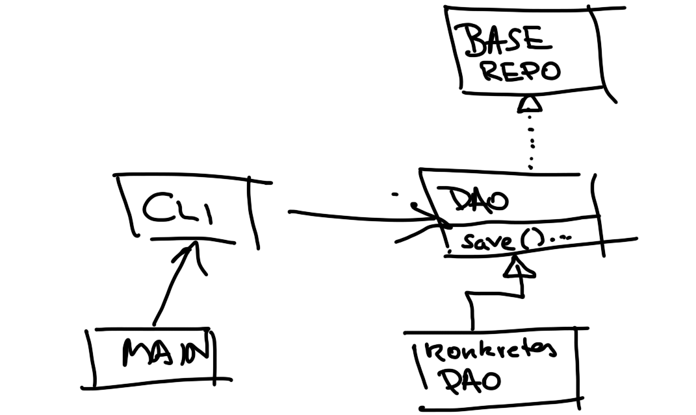
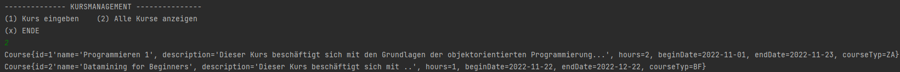
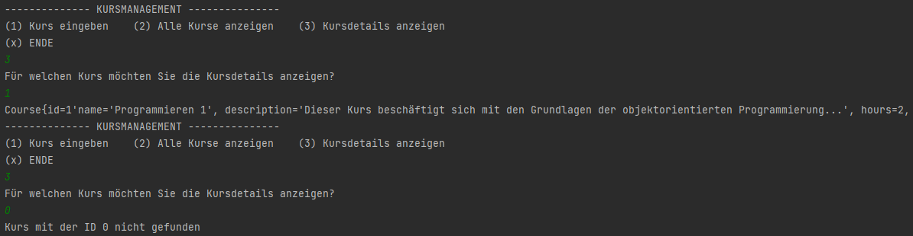
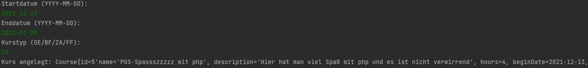
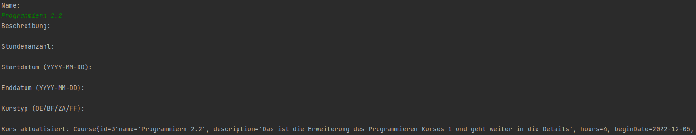
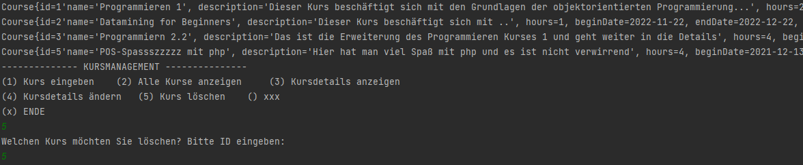
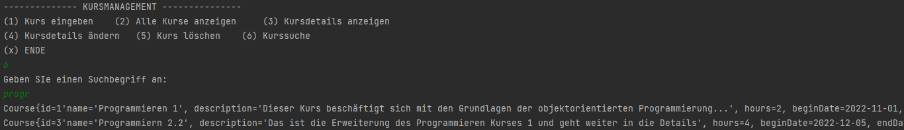
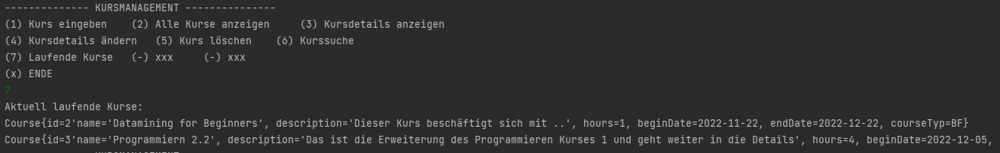

# JDBC und DAO - Kurse

Grundinformation über das *DAO-Entwurfsmuster* sind in der ersten README-Datei unter der Überschrift DAO - Entwurfsmuster zu finden. Grundinformationen über das *Singleton-Entwurfsmuster* sind ebenfalls in der ersten README-Datei unter der Überschrift Singleton - Entwurfsmuster zu finden. 

Die Setup Vorbereitung ändert sich nicht zu den vorherigen Aufgaben, hier nochmal der Grundablauf:

1. Mithilfe von XAMPP -> Webhoster und Datenbank starten
2. Anmeldung vom phpmyadmin durchführen
3. Neue Datenbank anlegen
4. Tabelle erstellen inklusive Zeilen
5. Erste Datensätze über das Interface des phpmyadmins hinzufügen
6. Neues Maven-Projekt anlegen (IDE nach Wahl)
7. Die mysql-connector-java Dependency in die pom.xml Datei einfügen.
8. Eine Klasse Main (kann auch App heißen, ist egal) für die main-Methode erstellen. 

## Datenbankverbindung mit Singleton:

Mit Hilfe vom Singleton-Pattern wird nun ein Singleton für eine Datenbankverbindung gebildet. Gegebenenfalls erstellt man ein neues Package, dieses enthält eine Singleton-Klasse mit geeignetem Namen (um welche Datenquelle handelt es sich). Die neu erstellte Klasse enthält nun eine Instanzvariable des Datentyps `Connection` (private static). Der Konstruktor ist `private`, um zu vermeiden das neue Objekte erstellt werden können (siehe Singleton - Entwurfsmuster). Abschließend wird eine Methode für die Verbindung einer Datenquelle bereitgestellt.

```java
public static Connection getConnection(String url, String user, String pwd) throws ClassNotFoundException, SQLException {
    //wenn eine Verbindung bereits besteht wird keine neue aufgebaut
    if(connection!=null){
        return connection;
    } else {
        Class.forName("com.mysql.cj.jdbc.Driver"); //prüfung ob es diese Klasse gibt
        connection = DriverManager.getConnection(url,user,pwd); //Verbindungsaufruf über DriverManager
        return connection;
    }
}
```

Zum Aufrufen des Singleton ist wichtig zu wissen, dass dieser nicht mit `new` erstellbar ist, sondern nur über die verfügbare `getConnection()`-Methode kommunizieren kann. 

```java
public static void main(String[] args) {
        // Datenbankverbindung über das Singleton
        try {
            Connection myConnection =
                    MySqlDatabaseConnection.getConnection("jdbc:mysql://localhost:3306/kurssystem","root","");
            System.out.println("Verbindung wurde hergestellt!");
        } catch (ClassNotFoundException e) {
            throw new RuntimeException(e);
        } catch (SQLException e) {
            throw new RuntimeException(e);
        }
    }
}
```


## CLI/UI-Implementierung

Ein einfaches CLI-Interface wird erstellt. Dabei werden dem Client vorerst nur die Eingabe eines Kurses und die Ausgabe aller Kurse angeboten. Realisiert wird die CLI mit einem `Scanner` und einer `Switch-Case`-Verzweigung. 


## Domänenklasse-Implementierung

Die Domänenklasse bildet mit Hilfe der Instanzvariablen eine Tabelle einer Datenbank ab. In diesem Fall ist es die Tabelle *courses* aus der Datenbank *kurssystem*.

Die ID wird in eine abstrakte Klasse (`BaseEntity`) ausgelagert, weil man sicher das Programm weiter entwickeln möchte (Personen, Lehrer, usw.). Demnach besitzen alle (zumindest die meisten) weiteren Domänenklassen eine ID. Um das setzten einer ID zu ermöglichen, wird eine Business-Logik implementiert.

```java
public void setId(Long id){
    if(id == null || id >= 0) //null -> es soll möglich sein, Domaenenklasse zu erzeugen um über die Datenbank eine id zu bekommen (insert) || >=0 -> soll später ein update (überschreiben) eines Kurses ermöglichen.
    {
        this.id = id;
    } else {
        throw new InvalidValueExeption("Kurs-ID muss größer gleich 0 sein!");
    }
}
```

Weiters wird eine *Exception-Klasse* erstellt um die Fehlerbehandlung zu realisieren. Diese wird `InvalidValueException` genannt und wird sich durch das ganze Programm ziehen. Es handelt sich bei der *Exception* um eine `RuntimeException` und ist somit eine *unchecked Exception*.

Es werden die *Getter* und *Setter* der Domänenklasse `Course` erstellt. Dabei werden die *Setter* mit einer Business-Logik versehen. Als Zusatz wird bei jedem *Setter*, sollte ein Fehler (Fehleingabe) passieren, die erstellte `InvalidValueException` geworfen -> es wird trotz einer *unchecked Exception* darauf hingewiesen, dass eine *Exception* geworfen werden kann. Das selbe wird auch bei den Konstruktoren gemacht.

```java
public void setName(String name) throws InvalidValueExeption { //obwohl uncheckd Exc geben wir es als info mit
```

Abschließend erbt die Domänenklasse `Course` alles von der `BaseEntity`-Klasse (extends) und es werden zwei Konstruktoren generiert. Einmal mit ID Übergabe und einmal ohne ID Übergabe. Eine `toString()`-Methode wird noch hinzugefügt. 

## DAO-Implementierung

Grundinformation über das *DAO-Entwurfsmuster* sind in der ersten README-Datei unter der Überschrift DAO - Entwurfsmuster zu finden. Hier wird das *DAO-Entwurfsmuster* angewendet.



Es wird ein `BaseRepository`-Interface erstellt um einfache Operationen mit der Datenbank ausführen zu können (siehe CRUD). Natürlich werden keine Methoden aus implementiert. Bei diesem Interface handelt es sich um das Grundkonstrukt und wird neuen Repositories angehängt. Damit ein Grundkonstrukt entstehen kann wird mit dem Datentyp `Optional` (generischer Typ) gearbeitet, das heißt man kann sich den Datentyp bei der expliziten Anwendung bzw. Methoden-Implementierung aussuchen. Dies ist praktisch, weil vielleicht wollen wir unser Programm erweitern und neue Repositories schreiben und somit andere Datentypen einfügen. 

```java
public interface BaseRepository<T, I> {
    //T = generischer Typ -> damit kann man mit allen beliebigen Referenztypen mit java arbeiten können
    Optional<T> insert(T entity);
    //I = ähnlich wie T -> weil vielleicht wollen wir nicht nur ein Long eingeben können
    Optional<T> getById (I id);
    List<T> getAll();
    Optional<T> update(T entity);
    void deleteById(I id);
}
```

Nach dem erstellten der `BaseRepository` wird nun konkretisiert. Es wird zwar erneut ein Interface erstellt, jetzt jedoch mit der Übergabe der richtigen Datentypen für die jeweiligen Methoden. Das neue Interface erbt (extends) von `BaseRepository` und heißt `MyCourseRepository` (= das eigentliche DAO) und bezieht sich spezifischer auf die Verwendung der Tabelle *courses* der Datenbank *kurssystem*, deren Domänenklasse `Course` heißt. Somit hat das erstellte DAO `MyCourseRpository` nun alle wichtigen Methodenköpfe (CURL) und jetzt auch getypt mit `Course` als Entitytyp und `Long` als Schlüsseltyp. Man kann nun auch weitere Methodenköpfe erstellen, um spezifischer auf die Entity einzugehen.

```java
public interface MyCourseRepository extends BaseRepository<Course,Long>{
    // Spezifikation
    List<Course> findAllCoursesByName(String name);
    List<Course> finAllCoursesByDescription(String description);
    List<Course> findAllCoursesByNameOrDescription(String searchText);
    List<Course> findAllCoursesByCourseTyp(CourseTyp courseTyp);
    List<Course> findAllCoursesByStartDate(Date startDate);
    List<Course> findAllCoursesByEndDate(Date endDate);
    List<Course> findAllRunningCourses();
}
```

## CRUD-Methoden Implementierung (CLI - konkrete Klasse)

Die konkrete Klasse wird zuerst kreiert und es wird das DAO Interface implementiert. Alle Methoden müssen nun aus implementiert werden (auch des ersten Interfaces `BaseRepository`). Davor wird noch im Konstruktor die Datenbankverbindung definiert (JDBC). 

Die erste Methode die aus implementiert wird ist die `getAll`-Methode. Es wird eine neue `DatabaseException `-Klasse erstellt, die sich ebenfalls im *dataacess*-Package befindet. Diese wird für Fehlermeldungen in Bezug auf Datenbank-Operationen sorgen (natürlich erst im Falle eines Fehlers). Die Implementierung der `getAll()`-Methode sieht sehr ähnlich wie bei den ersten Aufgaben (siehe JDBC) aus. Dafür braucht man ein `PreparedStatement`, welches ein SQL-Statement hält. Weiters wird ein `ResultSet` benötigt, um einerseits Datensätze aus der Datenbank zu entnehmen (`executeQuery()`) und andererseits für das Iterieren über alle Datensätze (`resultSet.next()`). Beim Iterieren über alle Datensätze geschieht nun objektrelationales Mapping, d.h wir wenden unsere Domänenklasse zum speichern aller Datensätze aus der Datenbank ein. 

```java
public List<Course> getAll() {
    String sql = "SELECT * FROM `courses`";
    try {
        PreparedStatement preparedStatement = con.prepareStatement(sql);
        ResultSet resultSet = preparedStatement.executeQuery();
        ArrayList<Course> courseList = new ArrayList<>();
        while (resultSet.next()) {
            courseList.add(new Course( //hier findet objektrelationals Mapping statt
                    resultSet.getLong("id"),
                    resultSet.getString("name"),
                    resultSet.getString("description"),
                    resultSet.getInt("hour"),
                    resultSet.getDate("begindate"),
                    resultSet.getDate("enddate"),
                    CourseTyp.valueOf(resultSet.getString("coursetyp"))
                    )
             );
        } 
        return courseList;
```

## Testprotokoll - CLI und `getAll()`

Das *CLI* wird nur das *DAO* und nicht die konkrete aus Implementierung halten, d.h es besteht keine Koppelung. Die Übergabe der konkreten *DAO*-Klasse geschieht erst in der `main()`-Methode. Das *CLI* wird nun um die `getAll()`-Methode erweitert. Die Behandlung der *Exceptions* geschieht erst in der `main()`-Methode in einem *try-catch-Block*. 

```java
private void showAllcourses() {
    List<Course> list = null;

    try {
        list = repo.getAll();
        if (list.size() > 0) {
            for (Course course : list) {
                System.out.println(course); // toString-Methode wird aufgerufen
            }
        } else {
            System.out.println("Kursliste ist leer!");
        }
    } catch (DatabaseException databaseException){
        System.out.println("Datenbankfehler bei Anzeige aller Kurse: " + databaseException.getMessage());
    } catch (Exception exception){ // alle anderen Exceptions
        System.out.println("Unbekannter Fehler bei Anzeigen aller Kurse " + exception.getMessage());
    }
}
```

Die `showAllCourses()`-Methode ist eine interne Methode der Klasse `CLI` und ist die erwähnte Erweiterung des *CLI*.

```java
public static void main(String[] args) {
    // CLI/UI
    try {
        Cli myCli = new Cli(new MySqlCourseRepository());
        myCli.start();
    } catch (SQLException e) {
        System.out.println("Datenbankfehler: " + e.getMessage() + " SQL State: " + e.getSQLState());
    } catch (ClassNotFoundException e) {
        System.out.println("Datenbankfehler: " + e.getMessage());
    }
```



## Testprotokoll - CLI und `getById()`

Für die Implementierung der `getById()`-Methode wird eine Utility-Klasse erstellt -> diese Hilft im weiteren Verlauf mit der `null`-Abfrage, bei allen weiteren Methoden. Weiters wird eine interne Methode für die Abfrage eines Datensatzes über die ID geschrieben (Gibt es einen Datensatz mit der entsprechenden ID).  

```java
public Optional<Course> getById(Long id) {
    Assert.notNull(id); //null check mit einer Utilityklasse
    if (countCoursesInDbWithId(id) == 0) {
        return Optional.empty();
    }
```

Hier sieht man die beschriebenen Schritte (Nullcheck -> mit `Assert`-Klasse und die Abfrage ob sich ein Datensatz mit entsprechender ID in der Datenbank befindet `countCoursesInDbWithId()`). Nach diesen wichtigen Abfragen kommt die Übergabe des Datensatzes in unsere Domänenklasse `Course`. Abschließend wird ein `Optional` als Rückgabewert zurückgegeben (`Optional.of(course)`). 

Für die Implementierung des *CLI* wird ebenfalls mit einem `Optional` gearbeitet. Doch die Komplexität ist ab hier nicht mehr wirklich hoch, da bei der aus Implementierung nur noch Methoden anderer Klassen aufgerufen werden müssen. 

```java
private void showCourseDetails() {
    System.out.println("Für welchen Kurs möchten Sie die Kursdetails anzeigen?");
    Long courseId = Long.parseLong(scan.nextLine());

    try {
        Optional<Course> courseOptional = repo.getById(courseId);
        if(courseOptional.isPresent()){
            System.out.println(courseOptional.get());

        } else {
            System.out.println("Kurs mit der ID " + courseId + " nicht gefunden");
        }
```



## Testprotokoll - CLI und `create()`

Diesmal geschieht das Mapping anders herum (von der objektorientierten Welt in die Datenbank). Ähnlicher Aufbau wie bei den Methoden zuvor. Da es sich aber nun um Client Eingaben handelt, sollte man im *CLI* zusätzlich zu den *Exceptions* noch eine *UI* Validierung machen (ist aber kein muss), um auf Eingabefehler konkreter zu reagieren.

Die Implementierung in der konkreten *DAO*-Klasse bezieht sich erneut auf unsere Domänenklasse. Hier will man die Eingaben vom Client entgegennehmen (nach der Validierung des *CLI*). Eine Besonderheit ist die `RETURN_GENERATED_KEYS`-Methode die uns einen generierten Schlüssel zurück liefert. Dieser wird abschließend mit Hilfe der Methode `getById()` beim Rückgabewert aufgerufen um einen `Course` zurück zu geben. Der zurückgegebene Kurs ist schon der angelegte Kurs, dieser wurde einfach wieder aus der Datenbank aufgerufen. 

```java
try {
    String sql = "INSERT INTO `courses` (`name`, `description`, `hours`, `begindate`, `enddate`, `coursetype`) VALUES (?,?,?,?,?,?)";
    PreparedStatement preparedStatement = con.prepareStatement(sql, Statement.RETURN_GENERATED_KEYS);
    
    //... mehr Code
    
     ResultSet generatedKeys = preparedStatement.getGeneratedKeys(); //keys zurückholen
     if(generatedKeys.next()){
         return this.getById(generatedKeys.getLong(1));
      }else {
      	 return Optional.empty();
      }
```



## Testprotokoll - CLI und `update()`

!Tipp! Um ein *SQL*-Statement schnell zu bekommen, kann man in den phpmyadmin schauen und sich über *bearbeiten* (beim entsprechenden Datensatz) eine *SQL*-Vorschau generieren lassen. So ändert man einfach alle Werte und klickt auf die *SQL*-Vorschau um sich das fertige *SQL*-Statement (in diesem Fall `UPDATE`) abzuholen. 

Die `update()`-Methode in der konkreten *DAO*-Klasse sieht ähnlich wie die `create()`-Methode aus. Natürlich ist diesmal das *SQL*-Statement kein `INSERT`, sondern ein `UPDATE`. 

Im *CLI* werden ein paar Tricks angewendet. Man holt sich alle Eingaben des Clients in der Form eines *Strings*. Da man ja vielleicht nicht alles im Datensatz ändern möchte, kann der Client mit dem Drücken auf *ENTER* eine Spalte auslassen und nicht verändern. In der darauffolgenden Abfrage, ob der Client nun Änderungen vorgenommen hat, setzt man den erwähnten Trick ein. 

```java
Optional<Course> optionalCourseUpdated = repo.update(
        new Course(
                course.getId(),
                name.equals("") ? course.getName() : name,
                description.equals("") ? course.getDescription() : description,
                hours.equals("") ? course.getHours() : Integer.parseInt(hours),
                dateFrom.equals("") ? course.getBeginDate() : Date.valueOf(dateFrom),
                dateTo.equals("") ? course.getEndDate() : Date.valueOf(dateTo),
                courseTyp.equals("") ? course.getCourseTyp() : CourseTyp.valueOf(courseTyp)
        )
);
```

Mit der Kurzschreibweise `?` kann man eine `if-else` Verzweigung nachbauen. Bei Veränderung der Daten wird dann der richtige Datentyp mitgegeben und man umgeht so das Problem einer leeren Eingabe (wegen *ENTER*).



## Testprotokoll - CLI und `delete()`

Die letzte CRUD-Methode ist die `delete()`-Methode für das Löschen eines Datensatzes. Der Code zeigt die Methode in der konkreten *DAO*-Klasse.

```java
public void deleteById(Long id) {
    Assert.notNull(id); //null check
    String sql = "DELETE FROM `courses` WHERE `id` = ?";
    try {
        if (countCoursesInDbWithId(id) == 1){
            PreparedStatement preparedStatement = con.prepareStatement(sql);
            preparedStatement.setLong(1, id);
            preparedStatement.executeUpdate();
        }

    }catch (SQLException sqlException){
        throw new DatabaseException(sqlException.getMessage());
    }
}
```

Kein Fehler, aber ein Verbesserungsvorschlag, wäre einen Rückgabewert zu definieren. Immerhin weiß man nicht im *CLI*, ob die Methode erfolgreich war (man könnte auch nichts gelöscht haben -> siehe Testprotokoll). Noch einfacher als die eben gezeigte Methode, ist die `delete`-Methode im *CLI*. Dabei wird nur der Wert des Clients übergeben und anschließend in die `delete`-Methode der konkreten *DAO*-Klasse übergeben und ausgewertet. Ähnlich wie bei der konkreten *DAO*-Klasse könnte man auch in der *CLI*-Klasse eine Überprüfung machen ob es den erwähnten Datensatz überhaupt gibt.



## Testprotokoll - CLI und weitere Spezialfälle

Nach den CRUD-Methoden, kommen nun zwei weitere Methoden die aus dem Kurs-*DAO* Interface stammen. Diese werden nun aus implementiert und heißen, `findAllCoursesByNameOrDescription()` und `findAllRunningCourses()`.

Allgemein ändert sich nicht viel zu den Vorgänger-Methoden. In der `findAllCoursesByNameOrDescription()`-Methode wird nach Namen und Beschreibung aller Kurse gesucht.  Das *SQL*-Statement sieht wie folgt aus: 

```java
String sql = "SELECT * FROM `courses` WHERE LOWER(`descripton`) LIKE LOWER(?) OR LOWER(`name`) LIKE LOWER(?)";
```

Die Suche nach den folgenden Sucheingaben soll wirklich die Datenbank mit dem entsprechenden *SQL*-Statement durchführen, damit die eigentliche Suche ausgelagert werden kann. Zum Schluss muss man noch diese Erweiterung dem *CLI* mitteilen bzw. ebenfalls eine entsprechende Methode implementieren um diese ausführen zu können. 



Die letzte Methode heißt `findAllRunningCourses()` und liefert alle aktuell laufenden Kurse. Die ganze Business-Logik steckt im *SQL*-Statement.

```java
String sql = "SELECT * FROM `courses` WHERE NOW()<`enddate`";
```

Erneut darf man nicht die Implementierung in der CLI-Klasse vergessen. Abschließend wird ein letztes mal getestet.


