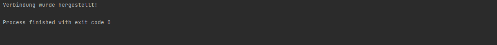
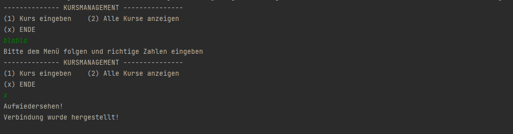
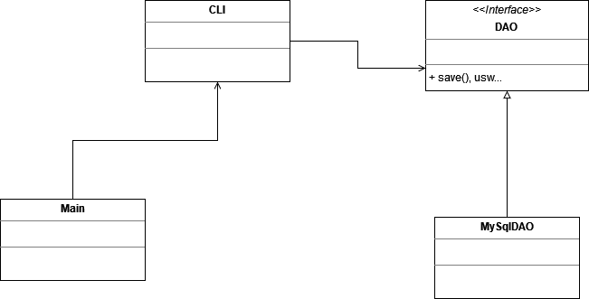

# JDBC und DAO - Kurse

Grundinformation über das *DAO-Entwurfsmuster* sind in der ersten README-Datei unter der Überschrift DAO - Entwurfsmuster zu finden. Grundinformationen über das *Singleton-Entwurfsmuster* sind ebenfalls in der ersten README-Datei unter der Überschrift Singleton - Entwurfsmuster zu finden. 

Die Setup Vorbereitung ändert sich nicht zu den vorherigen Aufgaben, hier nochmal der Grundablauf:

1. Mithilfe von XAMPP -> Webhoster und Datenbank starten
2. Anmeldung vom phpmyadmin durchführen
3. Neue Datenbank anlegen
4. Tabelle erstellen inklusive Zeilen
5. Erste Datensätze über das Interface des phpmyadmins hinzufügen
6. Neues Maven-Projekt anlegen (IDE nach Wahl)
7. Die mysql-connector-java Dependency in die pom.xml Datei einfügen.
8. Eine Klasse Main (kann auch App heißen, ist egal) für die main-Methode erstellen. 

## Datenbankverbindung mit Singleton:

Mit Hilfe vom Singleton-Pattern wird nun ein Singleton für eine Datenbankverbindung gebildet. Gegebenenfalls erstellt man ein neues Package, dieses enthält eine Singleton-Klasse mit geeignetem Namen (um welche Datenquelle handelt es sich). Die neu erstellte Klasse enthält nun eine Instanzvariable des Datentyps `Connection` (private static). Der Konstruktor ist `private`, um zu vermeiden das neue Objekte erstellt werden können (siehe Singleton - Entwurfsmuster). Abschließend wird eine Methode für die Verbindung einer Datenquelle bereitgestellt.

```java
public static Connection getConnection(String url, String user, String pwd) throws ClassNotFoundException, SQLException {
    //wenn eine Verbindung bereits besteht wird keine neue aufgebaut
    if(connection!=null){
        return connection;
    } else {
        Class.forName("com.mysql.cj.jdbc.Driver"); //prüfung ob es diese Klasse gibt
        connection = DriverManager.getConnection(url,user,pwd); //Verbindungsaufruf über DriverManager
        return connection;
    }
}
```

Zum Aufrufen des Singleton ist wichtig zu wissen, dass dieser nicht mit `new` erstellbar ist, sondern nur über die verfügbare `getConnection()`-Methode kommunizieren kann. 

```java
public static void main(String[] args) {
        // Datenbankverbindung über das Singleton
        try {
            Connection myConnection =
                    MySqlDatabaseConnection.getConnection("jdbc:mysql://localhost:3306/kurssystem","root","");
            System.out.println("Verbindung wurde hergestellt!");
        } catch (ClassNotFoundException e) {
            throw new RuntimeException(e);
        } catch (SQLException e) {
            throw new RuntimeException(e);
        }
    }
}
```



## CLI/UI

Ein einfaches CLI-Interface wird erstellt. Dabei werden dem Client vorerst nur die Eingabe eines Kurses und die Ausgabe aller Kurse angeboten. Realisiert wird die CLI mit einem `Scanner` und einer `Switch-Case`-Verzweigung. 



## Domänenklasse

Die Domänenklasse bildet mit Hilfe der Instanzvariablen eine Tabelle einer Datenbank ab. In diesem Fall ist es die Tabelle *courses* aus der Datenbank *kurssystem*.

Die ID wird in eine abstrakte Klasse (`BaseEntity`) ausgelagert, weil man sicher das Programm weiter entwickeln möchte (Personen, Lehrer, usw.). Demnach besitzen alle (zumindest die meisten) weiteren Domänenklassen eine ID. Um das setzten einer ID zu ermöglichen, wird eine Business-Logik implementiert.

```java
public void setId(Long id){
    if(id == null || id >= 0) //null -> es soll möglich sein, Domaenenklasse zu erzeugen um über die Datenbank eine id zu bekommen (insert) || >=0 -> soll später ein update (überschreiben) eines Kurses ermöglichen.
    {
        this.id = id;
    } else {
        throw new InvalidValueExeption("Kurs-ID muss größer gleich 0 sein!");
    }
}
```

Weiters wird eine *Exception-Klasse* erstellt um die Fehlerbehandlung zu realisieren. Diese wird `InvalidValueException` genannt und wird sich durch das ganze Programm ziehen. Es handelt sich bei der *Exception* um eine `RuntimeException` und ist somit eine *unchecked Exception*.

Es werden die *Getter* und *Setter* der Domänenklasse `Course` erstellt. Dabei werden die *Setter* mit einer Business-Logik versehen. Als Zusatz wird bei jedem *Setter*, sollte ein Fehler (Fehleingabe) passieren, die erstellte `InvalidValueException` geworfen -> es wird trotz einer *unchecked Exception* darauf hingewiesen, dass eine *Exception* geworfen werden kann. Das selbe wird auch bei den Konstruktoren gemacht.

```java
public void setName(String name) throws InvalidValueExeption { //obwohl uncheckd Exc geben wir es als info mit
```

Abschließend erbt die Domänenklasse `Course` alles von der `BaseEntity`-Klasse (extends) und es werden zwei Konstruktoren generiert. Einmal mit ID Übergabe und einmal ohne ID Übergabe. Eine `toString()`-Methode wird noch hinzugefügt. 

## DAO-Implementierung

Grundinformation über das *DAO-Entwurfsmuster* sind in der ersten README-Datei unter der Überschrift DAO - Entwurfsmuster zu finden. Hier wird das *DAO-Entwurfsmuster* angewendet.



Es wird ein `BaseRepository`-Interface erstellt um einfache Operationen mit der Datenbank ausführen zu können (siehe CRUD). Natürlich werden keine Methoden aus implementiert. Bei diesem Interface handelt es sich um das Grundkonstrukt und wird neuen Repositories angehängt. Damit ein Grunkonstrukt entstehen kann wird mit dem Datentyp `Optional` (generischer Typ) gearbeitet, das heißt man kann sich den Datentyp bei der expliziten Anwendung bzw. Methoden-Implementierung aussuchen. Dies ist praktisch, weil vielleicht wollen wir unser Programm erweitern und neue Repositories schreiben und somit andere Datentypen einfügen. 

```java
public interface BaseRepository<T, I> {
    //T = generischer Typ -> damit kann man mit allen beliebigen Referenztypen mit java arbeiten können
    Optional<T> insert(T entity);
    //I = ähnlich wie T -> weil vielleicht wollen wir nicht nur ein Long eingeben können
    Optional<T> getById (I id);
    List<T> getAll();
    Optional<T> update(T entity);
    void deleteById(I id);
}
```

Nach dem erstellten der `BaseRepository` wird nun konkretisiert, es wird zwar erneut ein Interface erstellt wird, jetzt jedoch mit der Übergabe der richtigen Datentypen für die jeweiligen Methoden. Das neue Interface erbt von `BaseRepository` und heißt `MyCourseRepository` und bezieht sich spezifischer auf die Verwendung der Tabelle *courses* der Datenbank *kurssystem*, deren Domänenklasse `Course` heißt. 
