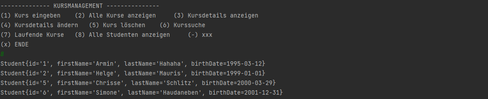

# JDBC und DAO – Studenten

Info: Der gesamte Quellcode befindet sich im Ordner kurssystem und wurde analog zur Aufgabe 3 (JDBC und DAO - Kurse) gestalltet. Somit ist es eine Erweiterung des bestehenden Codes.

---

Damit mit der Tabelle `studenten` in der Java-Umgebung gearbeitet werden kann, muss man diese erst mal in der Datenbank erstellen (man könnte auch ein entsprechendes SQL-Statement schreiben und ausführen). Die Tabelle befindet sich in der *kurssystem* Datenbank.


Im nächsten Schritt wird die Domänenklasse `Student` erstellt, um im weiteren Verlauf objektrelationales Mapping durchführen zu können. Die Klasse wird sich im Package *domain* befinden und wird von der `BaseEntity`-Klasse erben. Somit wird keine ID als Instanzvariable benötigt. 

Bei den *Getter* ist alles selbsterklärend. Bei den *Setter* kann man erneut eine `InvalidExcepton()` einbauen. Weiters wird in der Domänenklasse schon nach Fehleingaben geprüft (mit Business-Logik). Dabei ist der *Setter* des Geburtstags am spannendsten, weil man hier eine Abfrage des Datums braucht (befindet sich das Geburtsdatum vor dem heutigen Datum). Man könnte noch spezifischer auf den Geburtstag eingehen und nur Einträge von Studierenden mit 16+ Jahren erlauben. Abschließend wird eine `toString()`-Methode generiert.

```java
public void setBirthDate(Date birthDate) throws InvalidValueExeption {
    Date localDate = Date.valueOf(LocalDate.now());
    if (birthDate != null){ // null Abfrage 
        if (birthDate.before(localDate)){ //geburtstag darf nicht in der Zukunft liegt.
            this.birthDate = birthDate;
        }else {
            throw new InvalidValueExeption("Geburtsdatum darf nicht in der Zukunft liegen!");
        }
    }else {
        throw new InvalidValueExeption("Geburtsdatum darf nicht leer sein!");
    }
}
```

Ein kleines erstes Testprotokoll mit der Domänenklasse (Fehler erzeugen): 

```java
Student student = new Student("Armin", "Hammmmm",Date.valueOf("2023-12-03")); // Datum in der Zukunft
System.out.println(student);
```


---

Weiter geht es mit der Erstellung des `MyStudentRepository`, welches vom `BaseRepository` erbt (`extends`).  Nicht zu vergessen sind die generischen Typen, die richtig einzusetzen sind. Im Fall vom `MyStudentRepository` ist der erste Datentyp ein `Student` und der zweite ein `Long`. 

```java
public interface MyStudentRepository extends BaseRepository<Student,Long>{

    List<Student> findAllStudentsByFirstOrLastName(String searchText);
    List<Student> findAllByBirthYear(Date birthYear);
    List<Student> findAllBetweenBirthYears(Date fromYear, Date toYear);
}
```

Nun muss man das erstellte *DAO*-Interface konkretisieren und alle Methoden aus implementieren, dies geschieht mit der Klasse `MySqlStudentRepository`. Eine Instanzvariable der Klasse `Connection` wurde initialisiert, um eine Datenbankverbindung zu gewährleisten. Alle CRUD-Methoden wurden aus implementiert (*CLI* und im konkreten *DAO*). Weiters wurden Datensätze in die Tabelle eingefügt, um Testprotokolle über den *CLI* zu bekommen. Ein Testprotokoll der CRUD-Methode `getAll()` mit der Verwendung der `student` Tabelle wird eingeblendet:



Es wird jedoch nicht weiter auf die CRUD-Methoden eingegangen, da alle Methoden in der Aufgabe 3 schon präsentiert wurden. Stattdessen möchte ich auf eine Besonderheit in meinem Code verweisen, und zwar eine weitere UI bzw. eine Erweiterung der Vorhandenen. Nun ist es möglich zwischen Kursmanagement und Studentenmanagement zu wechseln ohne die *CLI* zu schließen. 


---

Abschließend widme ich mich der Ausimplementierung von einer spezifischen Methoden für die Tabelle `student` mit dem Namen `findAllStudentsByFirstOrLastName()`. Diese Methode erlaubt es dem Client alle Studenten mit einem Suchbegriff (über Vor- und Nachname) zu finden. Die Implementierung findet natürlich im konkreten *DAO* statt, welches `MySqlStudentRepository` heißt. 

```java
public List<Student> findAllStudentsByFirstOrLastName(String searchText) {
    try {
        String sql = "SELECT * FROM `student` WHERE LOWER(`firstname`) LIKE LOWER(?) OR LOWER(`lastname`) LIKE LOWER(?)";
        PreparedStatement preparedStatement = con.prepareStatement(sql);
        preparedStatement.setString(1, "%" + searchText + "%");
        preparedStatement.setString(2, "%" + searchText + "%");
        ResultSet resultSet = preparedStatement.executeQuery();
        //...mehr Code
```

Die eigentliche Suchfunktion steckt im *SQL*-Statement. Somit wird die Funktion ausgelagert und man spart sich eine Implementierung in der Java Umgebung. Voraussetzung ist natürlich das richtige Setzen bzw. Schreiben des *SQL*-Statements. Die Übergabe des Statements an die Datenbank geschieht wie gewohnt über das Zusammenspiel mittels `PreparedStatement` und `ResultSet`.


